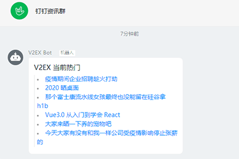

<h1 align="center">V2EX Action</h1>

<div align="center">

[](https://github.com/yanglbme/v2ex-action/actions) [](../../releases) [](./LICENSE) [](../../pulls)

</div>

自动爬取 V 站热门，发送到 webhook 地址，如企业微信群机器人。可配置 workflow 的触发条件为 `schedule`，实现周期性定时爬取。

## 入参

|  参数  |  描述  |  是否必传  |  默认值  |
|---|---|---|---|
| `webhook` | Webhook 地址 | 是 | - |
| `secret` | 签名密钥 | 否 | '' |
| `count` | 帖子数量 | 否 | 8 |

若是钉钉，务必**提供签名密钥**，企业微信则无须提供。


## 完整示例
可自定义 cron 表达式。

```yml
name: V2ex

on:
  schedule:
    - cron: '0 2 * * *'

jobs:
  build:
    runs-on: ubuntu-latest
    steps:
      - uses: yanglbme/v2ex-action@master
        env:
          webhook: ${{secrets.WEBHOOK}}
          secret: ${{secrets.SECRET}}
          count: 6
```

注意：

- cron 是 UTC 时间，使用时请将北京时间转换为 UTC 进行配置。
- 请在项目的 `Setting -> Secrets` 路径下配置好 `WEBHOOK` 与 `SECRET`(仅钉钉机器人要配置)，不要直接在 yml 中暴露地址跟密钥。


## 效果


## 许可证
[MIT](LICENSE)